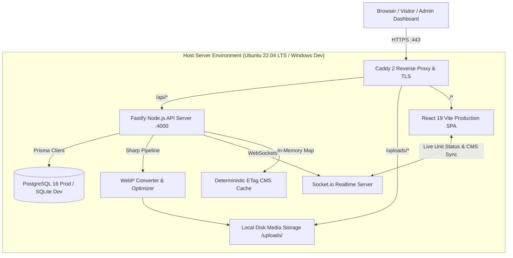

# Ajda Real Estate Platform — System Architecture

> **Last Updated**: 2026-10-01  
> **Status**: Production Architecture (Backend + Frontend + Realtime + CMS Engine)

---

## 1. System Overview

Ajda Real Estate is an enterprise real estate development and asset management platform for Saudi Arabia. It runs on a high-throughput, containerless architecture with an in-memory cached Content Management System (CMS), real-time unit synchronization, and granular role/action-based permissions.



---

## 2. Technology Stack

### Frontend
| Layer | Technology | Details |
|---|---|---|
| **Framework** | React 19 + TypeScript + Vite | Client-rendered SPA architecture |
| **Styling** | Tailwind CSS v4 + Vanilla CSS | Bespoke RTL (Arabic primary) / LTR (English secondary) |
| **Icons** | Lucide React | Uniform SVG icon design system |
| **Realtime** | `socket.io-client` | Auto-reconnect, consumer ref-counting, live unit & CMS revalidation |
| **Maps** | Google Maps Loader + Leaflet | Interactive Saudi property map with custom coordinate pins |
| **3D Rendering** | Three.js | Building elevations and floor visualizations |
| **CMS Client** | `CmsProvider` + SWR Hook | 0ms instant paint via `localStorage`, HTTP 304 ETag revalidation |

### Backend
| Layer | Technology | Details |
|---|---|---|
| **Runtime** | Node.js (v20+ LTS) | Native TypeScript (`tsx` dev / `tsc` build) |
| **Framework** | Fastify v5 | High throughput, asynchronous schema validation, lifecycle hooks |
| **Database** | PostgreSQL 16 (Prod) / SQLite (Dev) | Native installation, zero Docker overhead |
| **ORM** | Prisma v6 | Type-safe schema, migrations, automated seeders |
| **Media Processing** | Sharp | Automatic WebP conversion, EXIF stripping, size compression |
| **Auth & Security** | `@fastify/jwt` + bcrypt | JWT authentication, email OTP, rate-limiting, granular RBAC |
| **Realtime** | Socket.io Server | Real-time unit availability, new inquiry alerts, CMS push updates |
| **Testing** | Vitest | 21+ backend test suites for security, authorization, and CRUD |

### Production Infrastructure (No Docker)
| Component | Technology | Management |
|---|---|---|
| **Reverse Proxy** | Caddy 2 | systemd service, Cloudflare Origin CA TLS termination, gzip/zstd |
| **API Process** | Node.js Fastify | systemd service (`Restart=always`), journald logging |
| **Database** | PostgreSQL 16 | systemd service, daily automated `pg_dump` cron |
| **Static Media** | Local filesystem | `/opt/ajda/server/uploads/` served directly by Caddy & Fastify static |

---

## 3. Directory Layout

```
ajda/
├── deploy/                      # Production deployment configurations (Caddyfile, systemd units)
├── docs/                        # Project documentation suite
│   ├── archive/                 # Historical reference (original refactor.md, Kimi reviews)
│   ├── README.md                # Documentation navigation hub
│   ├── architecture.md          # System design and specifications (this file)
│   ├── cms-architecture.md      # Approved CMS v2.1 architectural plan
│   ├── api-reference.md         # Comprehensive REST & WebSocket API catalog
│   ├── deployment.md            # Production deployment guide
│   ├── testing-strategy.md      # Testing matrix and test suites
│   ├── gap-analysis.md          # Modern admin feature comparison
│   ├── CHANGELOG.md             # Chronological release and feature changelog
│   └── TODO.md                  # Active tasks, blockers, and roadmap
├── public/                      # Static assets & client logos
├── server/                      # Fastify backend application
│   ├── prisma/                  # Schema, migrations, seed scripts
│   ├── src/                     # Source code (routes, services, schemas, sockets)
│   └── test/                    # Vitest integration test suites
├── src/                         # React 19 frontend application
│   ├── components/              # UI components (admin, home, common, works)
│   ├── context/                 # Context providers (CmsProvider, Theme, Language)
│   ├── hooks/                   # Custom React hooks (useCmsContent, useRealtimeUnits)
│   ├── pages/                   # Public and admin route pages
│   ├── services/                # API client services
│   └── types/                   # TypeScript interfaces (cms.ts, property.ts, admin.ts)
└── a.txt                        # User notes file (strictly preserved)
```

---

## 4. Database Schema & Data Models

### 4.1 Real Estate Core Domain
- **`Project`**: Property development record (`title`, `slug`, `city`, `type`, `publishStatus`, `coordinates`).
- **`PropertyFloor`**: Architectural floor associated with a project (`floorNumber`, `floorNameAr/En`, `units`).
- **`PropertyUnit`**: Individual commercial/logistics/residential unit (`unitNumber`, `area`, `status`, `price`).
- **`CustomerInquiry`**: CRM lead generated from public contact/booking forms (`name`, `phone`, `type`, `notes`).
- **`CategoryItem`**: Managed taxonomy for project classifications and badges.

### 4.2 Content Management System (CMS) Models
- **`CmsSection`**: Document store for core pages (`key` PK, `content` JSON, `version`, `updatedAt`, `updatedById`).
  - Section Keys: `nav`, `footer`, `home`, `works`, `clientsPage`, `contact`.
- **`CmsSectionVersion`**: Audit snapshot table retaining the last 10 versions for 1-click rollback (`sectionKey`, `content`, `version`, `createdAt`, `createdById`).
- **`CmsClient`**: Relational partner/client directory (`nameAr/En`, `sectorAr/En`, `logo`, `tagsAr/En`, `websiteUrl`, `order`, `visible`).

### 4.3 Administration, HR & Security Models
- **`AdminUser`**: Backoffice administrator (`email`, `passwordHash`, `role`, `permissions` JSON, `departmentId`).
- **`Role`**: Team access role grouping (`slug`, `nameAr/En`, `permissions` JSON).
- **`Department`**: Corporate team department (`nameAr/En`).
- **`EmailOtp`**: 6-digit verification tokens for login and password recovery.
- **`LoginFailure`**: Anti-brute-force rate limiting and lockout state.
- **`NotificationListener`**: Subscription rules for email and in-app alerts on new inquiries.

---

## 5. Content Management System (CMS) Engine

### 5.1 High-Performance Multi-Tier Caching & Deterministic ETags
1. **Tier 1 (Instant First Paint - 0ms)**: Synchronously renders compiled defaults (`DEFAULT_CMS_CONTENT`) on cold visits or reads from `localStorage` (`ajda_cms_cache_v2`).
2. **Tier 2 (Deterministic ETag Verification)**:
   - Fastify generates deterministic ETags:
     - Section ETag: `W/"sec-${key}-v${version}-${updatedAt.getTime()}"`
     - Aggregated Content: `W/"cms-agg-v${maxVersion}-${latestTimestamp}"`
   - Client sends `If-None-Match`. On match, server returns **HTTP 304 Not Modified** with 0 bytes body.
3. **Tier 3 (Real-Time Push Invalidation)**:
   - When any admin updates content via `PUT /api/cms/content/:key`:
     - Version increments in DB, in-memory cache evicts stale key.
     - Socket.io broadcasts `cms:updated` and `cms:clients:updated`.
     - Connected clients revalidate silently in the background.

### 5.2 Frontend React CMS Layer & State Architecture
The client-side CMS consumption pipeline is architected for zero flash of unstyled content, instant offline-first rendering, and silent real-time hydration:

- **`CmsProvider` & Context (`src/context/CmsProvider.tsx`, `cmsContextDef.ts`)**:
  - Global provider mounted at the React tree root in `src/main.tsx`.
  - Reads immediately from `localStorage` (`ajda_cms_cache_v2`) on initialization to ensure 0ms first-paint latency.
  - Automatically establishes Socket.io subscription via `realtimeSocket.ts` and listens to `cms:updated`, `cms:clients:updated`, and `cms:cache:cleared`.
  - Re-fetches the latest ETag-validated content in the background and re-renders updated sections without full page reloads. Retains last-good state if network fails.
- **Ergonomic Consumer Hooks**:
  - `useCmsContent(sectionKey)`: Returns reactive section payload, typed directly via TypeScript discriminated unions.
  - `useCmsSection(sectionKey)`: Convenience hook with loading, error, and manual reload dispatchers.
  - `useCmsText(locale)`: Helper to extract localized text (`ar` vs `en`) with automatic fallback to Arabic.
  - `useCmsContact()`: Unified hook returning primary company phone, WhatsApp, email, address, and working hours with fallback.
- **Network & Socket Infrastructure**:
  - `src/services/cmsService.ts`: HTTP API methods handling `If-None-Match` headers, ETag caching, version history inspection, and 1-click rollback calls.
  - `src/services/realtimeSocket.ts`: Reference-counted singleton Socket.io client preventing duplicate socket connections and handling reconnection backoffs.
- **Media & Icon Utilities**:
  - `src/utils/cmsMedia.ts`: Path normalizer resolving `/uploads/`, `assets/...`, external CDN URLs, and extracting embed URLs from YouTube links.
  - `src/components/common/cmsIcons.ts` & `socialIcons.ts`: Maps CMS icon strings to Lucide React icons or SVG brand paths (covering 10 platforms: WhatsApp, X/Twitter, Instagram, LinkedIn, YouTube, Facebook, Snapchat, TikTok, Telegram, GitHub).
- **Public Component Integration**:
  - **`Navbar.tsx` & `Footer.tsx`**: Dynamic menu items, custom CTA button toggle, social channels, and legal copy.
  - **`HomePage.tsx`**: Dynamically toggles and renders 9 sections (`hero`, `about`, `services`, `process`, `projects`, `map`, `clients`, `cta`, `marquee`) based on individual `enabled` flags.
  - **`WorksPage.tsx`**: Header copy, dynamic tag filtering, process methodology cards, featured project banner, and conversion CTA.
  - **`ClientsPage.tsx`**: Hero copy, partners grouped by sector, testimonial slider/grid, and partnership CTA banner.

---

## 6. Granular Action-Level Permissions Model

Permissions are evaluated through an inheritance and direct-override algorithm:

```
                  ┌────────────────────────────────────────┐
                  │             SUPER_ADMIN                │
                  │        (Full System Access)            │
                  └───────────────────┬────────────────────┘
                                      │
              ┌───────────────────────┴───────────────────────┐
              ▼                                               ▼
┌───────────────────────────┐                   ┌───────────────────────────┐
│     PROJECTS DOMAIN       │                   │        CMS DOMAIN         │
├───────────────────────────┤                   ├───────────────────────────┤
│ viewProjects              │                   │ manageCms                 │
│ createProject             │                   │ manageClients             │
│ editProject               │                   │ rollbackCms               │
│ deleteProject             │                   │                           │
│ publishProject            │                   │                           │
└───────────────────────────┘                   └───────────────────────────┘
```

| Permission Key | Scope | Description |
|---|---|---|
| `viewProjects` | Projects | View all projects (including drafts/hidden) |
| `createProject` | Projects | Create new property records |
| `editProject` | Projects | Update existing properties, pricing, and media |
| `deleteProject` | Projects | Delete properties from the system |
| `publishProject` | Projects | Toggle public visibility (`published` / `draft` / `hidden`) |
| `manageCms` | CMS | Edit page copy, navbar items, and footer identity |
| `manageClients` | CMS | CRUD partners directory, logo uploads, and reordering |
| `rollbackCms` | CMS | Revert any CMS section to a previous point-in-time snapshot |
| `manageUnits` | Units | Interactive floorplan editor and live unit status toggles |
| `viewInquiries` | CRM | Customer inquiry management and status tracking |
| `exportData` | Reports | CSV and JSON data export |
| `manageUsers` | HR / Admin | User account administration, department assignment, and permission grants |
| `manageNotifications` | Settings | Email listener setup and SMTP delivery parameters |
