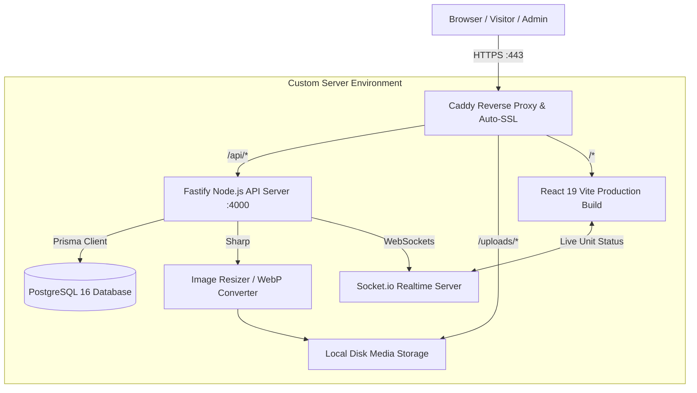

# 🏗️ Ajda Real Estate Platform — Architecture & Refactor Plan

> **Goal**: Convert the static frontend application (currently relying on `src/data/properties.ts` and `localStorage`) into a full-stack, production-grade Real Estate Management System running on a custom server.

> **Deployment decided**: **NO Docker**. Production = Caddy reverse proxy + systemd-managed Node Fastify + PostgreSQL 16 directly on the VPS. SQLite for local dev, PostgreSQL for production (see [Database Strategy](#5-decision-record)).

---

## 📋 Table of Contents
1. [System Architecture Overview](#1-system-architecture-overview)
2. [Technology Stack](#2-technology-stack)
3. [Target Directory Structure](#3-target-directory-structure)
4. [Step-by-Step Implementation Roadmap](#4-step-by-step-roadmap)
   - [Phase 1: Local Backend & Database Setup](#phase-1-local-backend--database-setup)
   - [Phase 2: Database Modeling & Data Seeding](#phase-2-database-modeling--data-seeding)
   - [Phase 3: API & Services Development](#phase-3-api--services-development)
   - [Phase 4: Frontend Service Integration](#phase-4-frontend-service-integration)
   - [Phase 5: Local Testing & Validation](#phase-5-local-testing--validation)
   - [Phase 6: Production Deployment — Caddy + systemd + PostgreSQL](#phase-6-production-deployment--caddy--systemd--postgresql-no-docker)
5. [Master TODO Checklist](#5-master-todo-checklist)

---

## 1. System Architecture Overview



---

## 2. Technology Stack

### 🖥️ Frontend (Existing & Enhanced)
- **Framework**: React 19 + TypeScript + Vite
- **Styling**: Tailwind CSS v4
- **State/Data Fetching**: Custom API client service with reactive updates
- **Realtime**: `socket.io-client` for instant unit reservation & inquiry alerts
- **Map & 3D**: Leaflet (interactive pins) + Three.js

### ⚙️ Backend (New - Custom Server)
- **Runtime**: Node.js (v20+) with TypeScript
- **Web Framework**: **Fastify** (Ultra-high performance, native JSON Schema validation, lightweight)
- **Database**: **PostgreSQL 16** (Relational integrity for Projects ➔ Floors ➔ Units ➔ Inquiries)
- **ORM**: **Prisma ORM** (Type-safe schema, automated migrations, includes visual **Prisma Studio**)
- **File & Media Storage**: Local filesystem disk storage + **`sharp`** (Auto-compresses 4K photos to WebP; directly serves PDFs like `ajdaa_prime.pdf`)
- **Authentication**: JWT (JSON Web Tokens) with `bcrypt` password hashing & Role-Based Access Control (RBAC)
- **Realtime Sync**: **Socket.io** (Bidirectional live events for unit status changes)

### 🚀 Production & Deployment
- **No containers** — direct services: Caddy 2 as reverse proxy (TLS via Cloudflare Origin Cert), systemd manages the Node API, PostgreSQL 16 runs natively.
- **Web Server / Reverse Proxy**: **Caddy 2** (static file streaming + reverse proxy `/api/*`, `/uploads/*`, `/socket.io/*`)
- **Process & Health Monitoring**: systemd `Restart=always` + `/api/health` endpoint + journald logs

---

## 3. Target Directory Structure

```
ajda/
├── server/                          # [DONE] Backend Node.js Fastify Application
│   ├── prisma/
│   │   ├── schema.prisma            # Canonical schema (SQLite provider = DEV)
│   │   ├── migrations/              # Committed POSTGRES migrations (prod)
│   │   ├── seed-data/               # projects.seed.ts (generated by sync-data.mjs)
│   │   └── seed.ts                  # Seeds admin users, categories, projects
│   ├── scripts/
│   │   ├── generate-prod-schema.mjs # schema.prisma → schema.postgresql.prisma
│   │   └── sync-data.mjs            # Frontend properties.ts → seed data
│   ├── src/
│   │   ├── config/                  # env.ts (zod), constants.ts
│   │   ├── middleware/              # auth, validate (zod)
│   │   ├── routes/                  # auth, projects, units, inquiries, media
│   │   ├── services/                # prisma, mediaService (sharp), serializers
│   │   ├── sockets/                 # Socket.io realtime handlers
│   │   ├── types/                   # Fastify/JWT type augmentation
│   │   ├── app.ts                   # buildApp() factory (testable)
│   │   └── server.ts                # Entry + listen
│   ├── uploads/                     # Local disk media storage (images, PDFs)
│   ├── .env.example                 # Environment template (committed)
│   ├── package.json
│   └── tsconfig.json
│
├── src/                             # [EXISTING] Frontend Vite Application
│   ├── services/
│   │   ├── api.ts                   # [NEW] Centralized API client (Phase 4)
│   │   ├── projectService.ts        # [NEW] Live API calls (Phase 4)
│   │   ├── inquiryService.ts        # [NEW] Live inquiry CRM (Phase 4)
│   │   ├── authService.ts           # [NEW] Live JWT auth (Phase 4)
│   │   └── adminStorage.ts          # [REFACTORED] localStorage → live services (Phase 4)
│   ├── hooks/
│   │   └── useRealtimeUnits.ts      # [NEW] Live socket listener (Phase 4)
│   └── ...
│
└── refactor.md                      # [THIS FILE] Architecture & Execution Plan
```

---

## 4. Step-by-Step Roadmap

### Phase 1: Local Backend & Database Setup
1. **Initialize Backend Workspace**:
   - Create `server/` directory.
   - Configure `package.json` with Fastify, `@fastify/cors`, `@fastify/multipart`, `@fastify/jwt`, `socket.io`, `sharp`, `bcrypt`, `dotenv`, and TypeScript.
2. **Setup Database Connection**:
   - Create `server/prisma/schema.prisma` (canonical schema, sqlite provider for dev).
   - Generate prod schema: `npm run db:gen:prod` → `prisma/schema.postgresql.prisma`.
   - Dev: `npm run db:push` (SQLite `dev.db`). Prod: committed Postgres migrations (`npm run db:migrate`).

### Phase 2: Database Modeling & Data Seeding
1. **Define Schema Entities**:
   - `AdminUser` (with roles: `super_admin`, `project_manager`, `sales_agent`, `viewer`).
   - `Project` (with multi-lingual fields, coordinates, pricing, badges).
   - `PropertyFloor` (floors linked to projects).
   - `PropertyUnit` (units with status: `available`, `reserved`, `rented`, `sold`).
   - `CustomerInquiry` (leads CRM pipeline: `new`, `contacted`, `closed`).
   - `CategoryItem` (commercial, logistics, office, residential).
2. **Write Data Migration/Seed Script**:
   - Parse existing [`src/data/properties.ts`](file:///d:/projects/html/ajda/src/data/properties.ts).
   - Insert all current projects, floors, and units into the database automatically.
   - Seed default admin user (`admin@ajdaa.sa`).

### Phase 3: API & Services Development
1. **Authentication & RBAC**:
   - `POST /api/auth/login` (generates JWT token).
   - `GET /api/auth/me` (verifies session).
   - Role-based route guards for Admin routes.
2. **Project & Unit Management APIs**:
   - `GET /api/projects` (with filters: city, type, priceType).
   - `GET /api/projects/:id` (returns full project with floors and units).
   - `POST /api/projects` & `PUT /api/projects/:id` (admin CRUD).
   - `PATCH /api/units/:id/status` (updates status and emits Socket.io event).
3. **Inquiries CRM APIs**:
   - `POST /api/inquiries` (public lead submission).
   - `GET /api/inquiries` (admin lead list with filters).
   - `PATCH /api/inquiries/:id` (update lead status & notes).
4. **Media & File Storage Service**:
   - `POST /api/media/upload` (accepts images & PDFs).
   - Image pipeline: Auto-compress to WebP using `sharp`.
   - Document pipeline: Store PDF brochures securely and return public `/uploads/...` URL.
5. **Real-time Engine**:
   - Setup Socket.io on Fastify server.
   - Broadcast `unit_status_updated` and `new_inquiry_received` events.

### Phase 4: Frontend Service Integration
1. **API Client Layer**:
   - Create `src/services/api.ts` with base URL, error handling, and JWT token injection.
2. **Refactor Data Access**:
   - Update [`src/services/adminStorage.ts`](file:///d:/projects/html/ajda/src/services/adminStorage.ts) to interface with the backend API instead of `localStorage`.
   - Provide backward-compatible async methods so existing components don't break.
3. **Admin Dashboard Upgrade**:
   - Update [`AdminDashboardPage.tsx`](file:///d:/projects/html/ajda/src/pages/admin/AdminDashboardPage.tsx):
     - Replace static image URL inputs with a real Drag-and-Drop file uploader.
     - Hook live project creation, unit editing, and user management to the API.
     - Connect inquiry CRM to live database.
4. **Real-time Unit Status Hook**:
   - Integrate `useRealtimeUnits` in [`ProjectDetailPage.tsx`](file:///d:/projects/html/ajda/src/pages/ProjectDetailPage.tsx) and unit modal so status updates reflect immediately across all open tabs.

> **Backend endpoints added in Phase 4** to unblock the frontend:
> `POST|PUT|DELETE /api/units`, nested `POST|PUT|DELETE /api/projects/:id/floors`,
> and `PUT|DELETE /api/auth/users/:id` (with last-super-admin and self-delete guards).

### Phase 5: Local Testing & Validation
1. Start backend server (`npm run dev` in `server`).
2. Start frontend dev server (`npm run dev` in root).
3. Verify full workflow:
   - Browse projects and floor plans on client site.
   - Submit a "Register Interest" inquiry.
   - Log into Admin Dashboard with live JWT auth.
   - View newly submitted inquiry in real-time.
   - Change a unit's status from `available` to `reserved` and observe instant UI update.
   - Upload a new project image and verify compression and display.

### Phase 6: Production Deployment — Caddy + systemd + PostgreSQL (NO Docker)
1. **Production stack** (all on the same VPS, no containers):
   - PostgreSQL 16 (`apt install postgresql`) with dedicated role + database.
   - Fastify API run under systemd (`ajda-api.service`) on `0.0.0.0:4000`.
   - Caddy reverse proxy terminates TLS and routes `/api/*`, `/uploads/*`,
     `/socket.io/*` to the API, and `/*` to the SPA build.
   - Node ≥ 20 (production runs `npm ci && npm run build`).
2. **Database migration**:
   - `npm run db:gen:prod` regenerates `prisma/schema.postgresql.prisma`.
   - Committed Postgres migrations applied via `npm run db:migrate` (Prisma migrate deploy).
   - Seed once with `npm run db:seed`.
3. **Operations**:
   - Automated nightly `pg_dump` backup (14-day rotation).
   - Health monitoring + ufw firewall rules.
   - `.env` secrets on the server only; never committed.

### Phase 7: Production API Deployment (VPS)
- [x] Frontend live at `https://ajda.weghetk.com` (Caddy + Cloudflare Origin Cert, no Docker)
- [ ] Install PostgreSQL 16 + create `ajda` role/database
- [ ] `server/.env` → Postgres `DATABASE_URL`, fresh `JWT_SECRET`
- [ ] `npm ci && npm run db:gen:prod && npm run db:migrate && npm run db:seed && npm run build`
- [ ] systemd unit `ajda-api.service` (restart on failure, logs to journald)
- [ ] Caddy: add `/api/*`, `/uploads/*`, `/socket.io/*` reverse_proxy blocks to existing site block
- [ ] Nightly `pg_dump` backup cron

---

## 5. Decision Record

- **No Docker** — user decision. Dev/prod parity is handled by two generated Prisma
  schemas instead of containers: canonical `schema.prisma` (SQLite, dev) →
  `prisma/schema.postgresql.prisma` (prod, generated by `npm run db:gen:prod`).
- **Prisma `provider` cannot use `env()`** (error P1012). Hence the generate step.
- **Seed data is generated** from `src/data/properties.ts` via `npm run db:sync-data`
  (no manual mirroring).
- **Dev sync** uses `prisma db push` (no dev migrations). **Prod** uses committed
  Postgres migrations (`prisma/migrations/`).
- **Media + unit-status routes are JWT-protected**; all request bodies validated with zod.

## 6. Master TODO Checklist

### Phase 1: Local Backend Setup
- [x] Initialize `server/` directory and configure `package.json`
- [x] Setup TypeScript configuration (`tsconfig.json`)
- [x] Install Fastify, Prisma, Socket.io, Sharp, Bcrypt, and Fastify JWT
- [x] Create `schema.prisma` with all relational models
- [x] Split env config (zod), app factory (`app.ts`) vs entry (`server.ts`), sockets module
- [x] Add `server/.env.example` + untrack `server/.env` (never commit secrets)

### Phase 2: Database Migration & Seeding
- [x] Generate initial Prisma migration (Postgres, committed in `prisma/migrations/`)
- [x] Build automated seed script importing data from `src/data/properties.ts` (via `sync-data.mjs`)
- [x] Execute seed script and verify database population (7 projects / 12 floors / 30 units / 4 users / 4 categories)
- [x] Test with Prisma Studio GUI (`npx prisma studio`)

### Phase 3: Fastify API Endpoints
- [x] Implement JWT Authentication & Auth Routes (`/api/auth`)
- [x] Implement Projects & Floors Routes (`/api/projects`)
- [x] Implement Units Routes & Status Updates (`/api/units`) — JWT protected
- [x] Implement Inquiries / CRM Routes (`/api/inquiries`)
- [x] Implement Media Upload Service with Sharp WebP compression (`/api/media`) — JWT protected
- [x] Implement Socket.io Realtime event broadcasting
- [x] zod request validation on all bodies + typed Fastify/JWT augmentation

### Phase 4: Frontend Refactoring
- [x] Create `src/services/api.ts` HTTP client
- [x] Create `src/services/propertyService.ts` for live project fetching
- [x] Create `src/services/inquiryService.ts` for inquiry submission
- [x] Create `src/services/authService.ts` for JWT login/session/user management
- [x] Create `src/services/mediaService.ts` for image/PDF upload with validation
- [x] Create `src/hooks/useAsyncData.ts` for async loading/error/reload state
- [x] Refactor `src/services/adminStorage.ts` to bridge with live API (categories remain local)
- [x] Update `AdminLoginPage.tsx` with live JWT login
- [x] Update `AdminDashboardPage.tsx` with real media upload, live CRM, realtime connection badge, and loading/error states
- [x] Migrate `UsersPermissionsManager.tsx`, `BuildingVisualizer.tsx`, `InteractiveProjectsMap.tsx` to async API calls
- [x] Update public pages/components (`WorksPage`, `ProjectsSection`, `ProjectsSec`, `BookingView`, `InterestRegistrationView`, `ProjectDetailPage`, `App`) to consume live API data
- [x] Add `useRealtimeUnits` hook to sync floor plan changes live

### Phase 5: Local Verification
- [x] Test public project browsing and filtering
- [x] Test inquiry submission flow
- [x] Test admin authentication & permissions
- [x] Test media upload (images & PDF brochures) + auth guards (401 without token)
- [x] Test unit status live synchronization between two browser windows

> Phase 4 note: `socket.io-client` is installed and the Vite dev server proxies
> `/api`, `/uploads`, and `/socket.io` to `http://localhost:4000`, so both
> servers can run on their default ports with no CORS configuration.
> Categories remain browser-local (`localStorage`) because no category API
> endpoint exists yet; the Prisma `CategoryItem` model is seeded but unexposed.

#### Phase 5 verification notes

Verified against a live API on `:4000` (login → CRUD → realtime), not just by
typecheck. Frontend and server typechecks pass, both `npm run build`s succeed, and
`npm run lint` (oxlint) is clean apart from 3 pre-existing warnings in
`ClientsPage.tsx` / `PropertyModal.tsx` that predate this phase.

Realtime was confirmed with two independent Socket.io clients: a single
`PATCH /api/units/:id/status` delivered `unit_status_updated` to both, then the
original status was restored.

The smoke run surfaced four real defects, all fixed:

1. **Inquiries trusted a client-supplied snapshot.** `projectTitle` / `unitNumber`
   came from the request body, so the CRM's key column was blank or spoofable
   whenever a client omitted or faked it. `inquiries.routes.ts` now resolves both
   from the referenced `Project` / `PropertyUnit` rows.
2. **Media upload trusted the declared mimetype.** `processAndSaveFile` branched on
   `data.mimetype` and saved anything non-`image/*` verbatim, so `.txt` / `.html` /
   `.svg` were accepted and served from `/uploads`. The type is now detected from
   magic bytes against an allowlist; images are always re-encoded through sharp.
3. **Oversized uploads dropped the connection.** A 51 MB body aborted the request
   instead of answering. `throwFileSizeLimit: false` plus a truncated-stream check
   returns a clean `413`, with the limit shared via `MAX_UPLOAD_BYTES`.
4. **`WorksPage` crashed on first paint.** The featured banner dereferenced
   `featured.image` while `properties` was still `[]`; the `error`/`loading` gate
   only covered the grid below it. `featuredDisplay` is now nullable and the banner
   is guarded. A stale `useMemo` dependency on `properties` was fixed at the same time.

Hardening added alongside: PDFs are served with `Content-Disposition: attachment` and
`X-Content-Type-Options: nosniff`, and the global error handler now honours an
explicit 4xx `statusCode` before Prisma mapping so validation errors are no longer
masked as `500`.

Smoke-created rows (inquiries, a unit, a floor, a user) and all uploaded files were
removed afterwards, leaving the database and `uploads/` in their original state.

### Phase 6: Production & Deployment (no Docker)
- [x] Frontend deployed behind Caddy + Cloudflare Origin Cert
- [x] Document complete deployment walkthrough in README + Phase 7 checklist
- [ ] Install PostgreSQL 16 + role/db on VPS
- [ ] Deploy API via systemd + Caddy `/api/*` `/uploads/*` `/socket.io/*` blocks
- [x] Nightly `pg_dump` backup script (`server/scripts/backup_db.sh`)

#### Phase 6 artifacts (authored; VPS steps still pending)

Everything in `deploy/` is written and syntax-checked, but the three unchecked items
above need shell access to the VPS, so they stay open.

| File | Purpose |
|---|---|
| `deploy/README-deploy.md` | Ordered walkthrough: system user, Node 22 + PostgreSQL 16, env files, build, systemd, Cloudflare Origin cert, Caddy, backups, firewall, routine deploy, rollback |
| `deploy/ajda-api.service` | systemd unit for `node dist/server.js`; `ProtectSystem=strict` with `ReadWritePaths` limited to `uploads/` |
| `deploy/ajda-backup.service` / `.timer` | Nightly 03:17 dump, `Persistent=true` so a missed run catches up |
| `deploy/Caddyfile` | SPA static + SPA fallback, `/api/*`, `/uploads/*`, and `/socket.io/*` (with `flush_interval -1` so broadcasts are not buffered) |
| `server/scripts/backup_db.sh` | `pg_dump` custom format, `pg_restore --list` verification, retention pruning, stable `ajda-latest.dump` restore target |

**Deploy ordering that is easy to get wrong:** `prisma/schema.postgresql.prisma` is
generated and gitignored, so `db:gen:prod` must run before `db:migrate`.

**Backup gap to close:** the dump covers the database only. `server/uploads/` needs
its own backup, or a restore yields a healthy database pointing at missing images.

#### Phase 6 bug fixes

Found while writing the deploy config, both in `server/src/config/env.ts`:

1. **`CLIENT_ORIGIN` ignored its documented format.** `.env.example` promised a
   comma-separated list, but the code used the raw string as a single origin, so any
   second origin silently produced a CORS allowlist matching nothing. It is now split
   on commas and trimmed.
2. **Development origins leaked into production.** `localhost:5173` and
   `127.0.0.1:5173` were appended unconditionally, and CORS runs with
   `credentials: true` — so a page served from a developer's machine could make
   credentialed cross-origin calls to the live API. They are now added only when
   `NODE_ENV !== 'production'`.

Verified by running the API in both modes: in production both configured origins
receive `Access-Control-Allow-Origin` while `localhost:5173` and an unknown origin
receive no CORS header; in development the loopback origins still work.

### Phase 8: Admin dashboard overhaul (in progress)
- [x] Edit existing projects (ProjectEditorModal; any YouTube link form normalized)
- [x] Sidebar shows the signed-in admin; unique generated unit ids
- [ ] Admin URLs: `/admin/overview`, `/admin/projects`, `/admin/projects/:id/units`, `/admin/inquiries`, `/admin/categories`, `/admin/users`
- [ ] Fixed-height header on every page (was collapsing to 39px on long pages); per-page header actions instead of a global "new project"
- [ ] Split `AdminDashboardPage.tsx` (~1550 lines) into a layout + one file per section
- [ ] Permission-aware UI (hide tabs/actions the admin cannot use; one failing resource must not blank the whole dashboard)
- [ ] Mobile drawer navigation; card layout for tables on small screens
- [ ] Inquiries: search, notes, delete (super admin), CSV export
- [ ] Categories: API-backed CRUD, tag removal, "new category" in the header
- [ ] Project brochure persisted (`Project.brochureUrl`)
- [ ] Seed images copied to `uploads/seed/` (source paths 404 at runtime); seed no longer wipes projects on re-run
- [ ] Remaining UI review items (empty states, styled confirm dialog, date formatting, users "last active", overview charts)

#### Phase 8 follow-ups (requested 2026-09-29)
- [x] Unit status: admin sets any unit directly to متاح / محجوز / مؤجر / مباع from a select — done in the project page's Units tab (`/admin/projects/:id`); the floor-plan chip still cycles
- [ ] Cities list: a curated list of the main Saudi cities (AR + EN names, region, center coordinates) used by the project create/edit forms and public filters instead of free text
- [ ] Map location picker in the project editor: click or drag a pin on the map to set lat/lng (reuse the Google Maps loader the public map already uses); search box to jump to a city/place
- [ ] Theme (light/dark, classic/prime) and language (AR/EN) switchers inside the admin dashboard header
- [ ] Project types CRUD: admin creates / renames / deletes project types (currently تجاري، سكني، فنادق، لوجستي + إداري). Today `type` is a fixed 5-value union in code and in the public filters/map legend. Plan: make the existing `CategoryItem` table the source of truth for types (slug, nameAr, nameEn, icon/colour, sort order), load it in the public filters and map, and block deleting a type still used by projects (or require reassigning them first). Decide whether `office` (إداري) stays — the request lists only 4.
- [ ] Sub-categories: admin creates sub-categories under a project type (e.g. تجاري → محلات، معارض، مكاتب). Needs a `parentId` on the type table (one level deep), an optional sub-category on projects (must belong to the project's type), and a filter on the public works page. Replaces or absorbs today's free-text category "tags" — decide which.

#### Phase 8 follow-ups — floor plan & categories (requested 2026-09-29, done)
- [x] Rename floors (AR/EN) from the floor plan; server now also updates the floor name copied onto its units
- [x] Floor plan: projects as a horizontal picker strip instead of a dropdown
- [x] Floor plan: floors display as sidebar list or grid; unit grid columns auto / 2 / 3 / 4 / 5; resizable floor panel (remembered per browser)
- [x] Categories page: grid (1–4 columns) / list / compact table layouts (remembered per browser)
- [x] Contact form sends a real inquiry (was discarded); newsletter subscribers stored via `/api/newsletter` from the footer form
- [x] Project page `/admin/projects/:id`: tabs overview / units / inquiries; units grouped by expandable floor rows with a direct status select
- [x] "عرض الموقع الحي" opens the public site in a new tab

#### Phase 8b: Users, roles & admin preferences (requested 2026-09-29, planned)
- [ ] Users page layouts: table / grid / stack (top-to-bottom list), remembered per browser
- [ ] User create & edit as proper forms (page or full dialog): name, email, department, role, status, password reset
- [x] **Universal delete confirmation** (owner request 2026-09-30: "admin user must confirm before delete any item"): every delete or removal goes through `confirmDelete` (red dialog, "cannot be undone", never remembered). Added to category tag removal, gallery image and brochure removal; existing deletes moved onto it.
- [x] Confirmation dialog before every on/off action (activate/deactivate user, enable/disable, status toggles) with a "لا تسألني مرة أخرى" checkbox; the choice is stored per admin and per action type, and can be reset from the settings page
  - Shipped 2026-09-30: user activate/suspend, project publish/hide, inquiry status, listener on/off; choices stored server-side per admin (`/api/auth/me/preferences`), reset on the profile page. Bulk actions and deletes always ask (server rejects any other key).
- [ ] Admin settings page (`/admin/settings`): profile (name, email), change password, theme + language, default layouts, reset "don't ask again" choices. Preferences stored **server-side per admin** (new `AdminPreference` JSON column or table) so they follow the admin across browsers
- [ ] HR pages: CRUD for **roles**, **permissions** and **departments**
  - Today `role` is a fixed 4-value string and permissions are 5 hard-coded booleans on each user, checked by name in every server route (`requirePermission('manageProjects')`)
  - Target: `Role { id, nameAr, nameEn, permissions[] }`, `Department { id, nameAr, nameEn }`, users reference a role + department; a user's effective permissions come from the role (optionally with per-user overrides)
  - Permissions stay a **fixed catalogue defined in code** (they must match what the server checks); admins compose roles from it rather than inventing new permission names that no route enforces
  - Guards: `super_admin` role cannot be deleted or stripped; a role or department in use cannot be deleted without reassigning; nobody can escalate their own role (existing rule)
  - Migration: map the 4 existing roles to seeded Role rows and each user's current booleans to a role (or overrides), so no user loses or gains access

#### Phase 8c: Publishing, data tables, drafts, media & SEO (requested 2026-09-29, planned)

**Publishing**
- [ ] Projects: published / unpublished toggle on `/admin/projects` (card + table + project page). Unpublished projects are hidden from the public site (list, map, detail page returns 404) but stay fully editable in the admin
  - Server: `Project.publishStatus` (`draft` | `published` | `hidden`) + `publishedAt`; public `GET /api/projects` returns only `published`; admin reads use an authenticated endpoint/flag that includes all
  - Migration default `published` for existing rows so nothing disappears on deploy
  - Toggle goes through the confirm dialog (with "don't ask again", see Phase 8b)

**View switcher on every list page** (the table / list / grid control from the categories page)
- [ ] Shared `ViewSwitcher` component + per-page remembered choice (`usePersistentState`): projects, inquiries, users, categories, units, newsletter subscribers
- [ ] Each page defines what table / list / grid mean for its data; grid supports a column-count choice where it helps

**Data table** (replace the plain compact tables)
- [ ] Shared `DataTable` component used by every table view: column sorting (click header, asc/desc, RTL-aware icons), per-column filters + global search, row selection with bulk actions (delete, publish/unpublish, change status, export selected), sticky header, column show/hide, density (comfortable/compact), pagination or virtual scroll for long lists, empty/loading/error states, keyboard navigation, remembered sort/columns per page
- [ ] Visual redesign: clear header row, zebra/hover states, aligned numeric columns, truncated long cells with tooltip, status as chips, row actions grouped in a menu on narrow screens

**Drafts**
- [ ] Projects: "save as draft" (a project can be saved incomplete; required-for-publish checks run only on publish). Uses `publishStatus = draft`
- [ ] Other forms (users, categories, units, content): local auto-saved drafts of unsaved forms, restored on return ("لديك مسودة غير محفوظة — استعادة / تجاهل")
- [ ] How drafts surface (chosen approach): **status filter chips on each list** (الكل / جاهز / مسودة, with counts) **plus a dismissible banner at the top** of the page when drafts exist ("3 مشاريع في وضع المسودة — عرضها")
- [ ] Users: "draft" maps to an **invited / pending** account state (created but not activated), not a half-typed form

**Project page: 3D model**
- [ ] Upload a 3D model per project (`.glb` preferred, `.gltf`); media allowlist extended with magic-byte check for glTF/GLB, separate size limit (e.g. 50 MB), stored under `uploads/models/`
- [ ] Preview in the admin and a real viewer on the public project page, replacing the "3D tour coming soon" button (three.js is already a dependency; `<model-viewer>` is the lighter alternative)
- [ ] `Project.model3dUrl`; `virtualTour3dAvailable` becomes derived from it

**Project page: image editor & format**
- [ ] In-browser image editor before upload and for existing gallery images: crop (free + preset ratios 16:9, 4:3, 1:1), rotate/flip, resize, brightness/contrast, text overlay, watermark. Library candidates: Filerobot Image Editor (crop + annotate + text + filters) or a lighter crop-only tool plus canvas text
- [ ] Output format choice: WebP (default), AVIF, JPEG, with quality slider; the server already re-encodes every image with sharp, so the chosen format + quality are passed as upload options and validated server-side
- [ ] Keep the original upload (so edits are non-destructive and undoable — ties into Phase 9 activity log)

**SEO**
- [ ] Per-project SEO panel in the project editor: slug (Arabic-friendly), meta title + description (AR/EN, with length counters and a Google-style preview), OG/share image, keywords, canonical, noindex toggle
- [ ] Site-wide SEO in the admin (part of Phase 9 CMS): default title template, per-page meta for every public page, Organization + RealEstateListing JSON-LD, `sitemap.xml` (projects + pages, AR/EN `hreflang`), `robots.txt`, favicon/app icons, social profiles
- [ ] SEO checklist per project/page (missing description, title too long, no share image, duplicate titles)
- [ ] **Caveat:** the site is a client-rendered SPA. Meta tags set in the browser are not read by social-media link previews and only partly by some crawlers. To make SEO real, the server must return the right `<title>`/meta/OG/JSON-LD in the HTML for each URL: either Fastify renders the SPA `index.html` with injected tags for `/projects/:id` and pages (smallest change, works with Caddy), or pre-render at build/publish time. Decide before building the SEO UI

**Newsletter admin**
- [ ] Admin screen for newsletter subscribers (list, search, delete, CSV export) — backend and service are done (`/api/newsletter`)

#### Phase 8d: CRUD in the project Units tab, sidebar & overall design (requested 2026-09-29)
- [ ] Project page Units tab (`/admin/projects/:id` → الوحدات): full CRUD without leaving the page — add floor, rename floor, delete floor, add a unit to a specific floor, edit unit, delete unit. Reuse the floor-plan dialogs (one shared unit form + floor form) so both screens behave identically
- [ ] Improve the admin sidebar: grouped navigation (portfolio / customers / settings), collapsible to an icon rail on desktop (remembered), clearer active state, counts that don't compete with labels, user card with quick actions (settings, theme, language, logout)
- [ ] Improve the overall admin UI design: consistent page header + section spacing, one card style, one button hierarchy (primary / secondary / ghost / danger), consistent form controls, typography scale, and dark-mode contrast pass across every page

#### Phase 8e: Settings, profile & account security (requested 2026-09-29)
- [ ] **Admin (system) settings page** `/admin/settings/system` (super_admin): site-wide settings — company info, contact details, social links, default language/theme, upload limits, session length, security policy (password rules, 2FA required for roles)
- [ ] **User settings page** `/admin/settings` for every admin: theme, language, default layouts/views, "don't ask again" choices reset, notification preferences
- [ ] **Profile page** `/admin/profile`: update name, email (re-verify), phone, avatar, department (read-only unless HR permission); **change password** (current password required, strength rules, all other sessions signed out after change)
  - Shipped: name/email/phone, change password (keeps this session, revokes the others), email-OTP toggle. Still open: email re-verify, avatar, department.
- [ ] **2FA (TOTP)**: enable with QR code (authenticator app), verify a code before activation, 10 one-time recovery codes (shown once, stored hashed), require the code at login, disable only with password + code; super_admin can require 2FA per role
- [ ] **Passkeys (WebAuthn)**: register several passkeys per admin (named devices), sign in with a passkey, list/rename/remove; needs `@simplewebauthn/server` + `@simplewebauthn/browser` (new deps — approval needed) and an HTTPS origin (localhost is allowed in dev)
- [ ] Session security that 2FA/passkeys depend on: short-lived access token + refresh token or server-side sessions, "sign out all devices", list of active sessions with device/IP/last seen (today the JWT lasts 12h and cannot be revoked individually)

#### Phase 8f: Gap review — what a standard modern admin has that this one lacks (2026-09-29)
See the list under "Admin gap review" at the end of this file.

#### Phase 8g: Email + OTP (requested 2026-09-30, in progress)
- [x] Mail service (Gmail SMTP via MAIL_* env; secrets only in server/.env, never in git), Arabic RTL templates
- [x] Email OTP: login verification (per-admin toggle, or LOGIN_OTP_REQUIRED for all), forgot/reset password by 6-digit code (10 min, 5 attempts, resend 60 s, rate-limited)
- [x] Notifications: new inquiry → admins with viewInquiries (or NOTIFY_INQUIRY_EMAILS); password changed → that admin
- [x] UI: login OTP step, forgot/reset password screens, OTP toggle on the profile page
- [x] Users page layouts + role-based forms (f99b735); [ ] HR pages roles/departments (in progress)

### Working rules (from the owner)
- Every item and note the owner sends is recorded in this file (the TODO / phase lists), not only in chat
- `README.md` stays clean: setup, architecture and API reference only — no task lists or notes

### Phase 9: Full site CMS + activity log with undo (planned)

**Goal:** every piece of public-site content is editable from the admin dashboard, every
change is recorded with who made it, and any change can be undone.

Scope has to be pinned down before building: "anything on any page" means turning all
hard-coded copy, images, links and section layout into database content. Today most
public pages (home hero, about, clients, video section, contact, footer, navbar) are
static JSX with inline Arabic/English strings.

1. **Content model**
   - [ ] Inventory every public page/section and each editable field (text AR/EN, image,
         link, video, list items, visibility/order of sections)
   - [ ] `SiteContent` model: `{ key (e.g. home.hero.title), locale|null, type
         (text|richtext|image|url|json), value, updatedAt, updatedBy }`; lists
         (clients, stats, FAQs, social links) as typed JSON blocks with a zod schema per key
   - [ ] Section registry: per page, ordered sections with `visible` flag
   - [ ] Public read API with caching (`GET /api/content?page=home`), admin write API
         (new permission `manageContent`)
2. **Frontend refactor**
   - [ ] `useContent(key, fallback)` hook; replace hard-coded strings/images page by page
         (current values become the seed + fallback so the site never renders blank)
   - [ ] Admin "Site content" section: page → section → fields editor, image upload,
         live preview of the public page
3. **Activity log**
   - [ ] `ActivityLog` model: `{ id, at, actorId, actorName (snapshot), action
         (create|update|delete|status|restore), entityType, entityId, before JSON,
         after JSON, revertedById? }`
   - [ ] Written inside the same DB transaction as the change, for every admin write:
         projects, floors, units, unit status, inquiries, categories, users, media,
         site content. Passwords/hashes are never stored in `before/after`
   - [ ] Admin "Activity log" page: filter by user / entity / date, diff view (before → after)
4. **Undo**
   - [ ] `POST /api/activity/:id/revert` re-applies `before` (update), re-creates
         (delete), or deletes (create) — itself logged as a new entry, so undo is undoable
   - [ ] Conflict rule: refuse (409) if the entity changed after that entry, unless the
         admin reverts the newer entries first; show why in the UI
   - [ ] Deletes become recoverable: keep the full `before` snapshot incl. children
         (a project delete must restore its floors and units; inquiries linked to it)
   - [ ] Limits: media files are not deleted from disk on delete (so image undo works);
         define retention for log rows
   - [ ] Permission: reverting requires the permission of the original action; user-account
         changes revertible by super_admin only
5. **Tests**: log written for each write route; revert round-trips per entity; conflict 409;
   no secret leakage in log payloads

## Admin gap review (2026-09-29)

What a standard modern admin panel has that this one does not yet have, grouped and ordered by risk/value.
Verified against the code (e.g. no rate limiting, password reset, CAPTCHA, email sending or error monitoring exist anywhere).

### A. Security & accounts (highest risk)
- [ ] **Rate limiting** on login and on public forms (`/api/auth/login`, `/api/inquiries`, `/api/newsletter`) — today unlimited password guessing and form spam are possible (`@fastify/rate-limit`)
- [ ] **Spam protection** on public forms: honeypot field + time-to-submit check, optional CAPTCHA (Turnstile) for the contact/interest/newsletter forms
- [x] **Forgot / reset password** by email (6-digit code; Phase 8g)
- [ ] **Email delivery** (SMTP/transactional provider) — prerequisite for password reset, new-inquiry notifications, 2FA recovery
- [ ] 2FA, passkeys, session list/revoke, password policy → Phase 8e
- [ ] Account lockout after repeated failed logins, login history per admin
- [ ] Audit/activity log → Phase 9

### B. Shell & navigation
- [ ] Global search / command palette (Ctrl+K): jump to a project, unit, inquiry, user, or page
- [ ] Notifications center: bell with unread count for new inquiries (realtime event already exists), mark read
- [ ] Breadcrumbs on nested pages (project → units / edit)
- [ ] Collapsible sidebar, user menu dropdown (profile, settings, theme, language, logout) → Phase 8d
- [ ] Admin UI in English too (the public site is bilingual, the admin is Arabic-only)
- [ ] Keyboard shortcuts (new item, save, search)

### C. Data management
- [ ] Server-side pagination/search/sort for lists that will grow (inquiries, subscribers) — everything is loaded client-side today
- [ ] Saved filters / saved views per admin
- [ ] Import (CSV/Excel) for units and projects; export for every list (projects, units, users), not only inquiries/newsletter
- [ ] Soft delete + **trash/recycle bin** with restore (today deletes are permanent) — overlaps Phase 9 undo
- [x] Duplicate project (copy with floors/units as a new draft) — 2026-09-30, "نسخ المشروع" on cards, table, list and project page
- [ ] Display order: drag to reorder projects/categories as they appear on the site
- [ ] **Media library**: browse and reuse uploads, alt text (AR/EN), usage tracking, delete unused files (uploads are never cleaned up today)
- [ ] Rich-text editor for project descriptions (headings, lists, links) instead of plain textareas
- [ ] Version history per project (who changed what, restore) → Phase 9

### D. CRM for inquiries (sales workflow)
- [ ] Assign an inquiry to a sales agent; "my inquiries" filter
- [ ] Follow-up reminders / tasks with due dates
- [ ] Pipeline (kanban) view: new → contacted → negotiating → won / lost (today only new/contacted/closed)
- [ ] Customer records: group several inquiries from the same phone/email into one customer
- [ ] Lead source tracking (page, campaign/UTM, referrer) captured with each inquiry
- [ ] Message templates for WhatsApp/email replies
- [ ] Email/WhatsApp notification to the sales team on each new inquiry

### E. Dashboard & insights
- [ ] Date-range filter on the overview (7/30/90 days, custom)
- [ ] Conversion metrics: inquiries → contacted → closed, response time, per project/agent
- [ ] Site analytics (visits, top projects) — e.g. Plausible/Umami or GA4, shown in the overview
- [ ] Scheduled email report (weekly summary)

### F. Operations & reliability
- [ ] Error monitoring for API and SPA (Sentry or similar) + structured alerting
- [ ] Backups visible in the admin (last backup time, size) and a documented restore; uploads/ included
- [ ] System status page (API, database, disk, realtime)
- [x] Maintenance mode / announcement banner for the public site (settings tab "الإعلان والصيانة"; public rendering delegated to agy 2026-09-30)
- [ ] Redirects manager (old URLs → new), 404 log
- [x] **Settings page** `/admin/settings` (owner request 2026-09-30: "admin dashboard settings where admin can edit the
  - 2026-09-30: added tabs "الإعلان والصيانة" (announcement strip, maintenance mode) and "الأمان" (require the email login code for every admin; LOGIN_OTP_REQUIRED in .env still wins). SEO defaults tab deferred: the SPA serves one index.html, so per-page meta needs server-side injection or prerendering first (owner decision pending).
  whole website settings", not just mail). Tabs: **Contact info** (phone, WhatsApp, email, address ar/en, working
  hours ar/en, social links; public `GET /api/settings/site`, today's hard-coded values as fallback, replaces the
  copies in Navbar/Footer/Contact/Clients/booking) and **Mail** (below). Later tabs: SEO defaults, maintenance mode /
  announcement banner, inquiry notification recipients (NOTIFY_INQUIRY_EMAILS), OTP policy.
- [x] **Notification listeners** (owner request 2026-09-30): settings tab "Notifications" to choose what happens when a new
  interest (inquiry) is created and who is emailed; new permission `manageNotifications` lets a user edit it and create
  listeners on the `inquiry.created` event. Listener = event + channel (`email` now; WhatsApp/webhook later) + recipients
  (admins with viewInquiries and/or an email list) + enabled. Until the first listener is created the old behaviour
  (NOTIFY_INQUIRY_EMAILS, else viewInquiries admins) applies; after that only listeners do.
- [x] **In-app new-inquiry notifications** (owner request 2026-09-30): toast, header bell with unread count, desktop notification.
- [x] **Mail settings page** (owner request 2026-09-30): admin page to edit the `MAIL_*` SMTP settings and send a test email.
  Decisions: stored in an `AppSetting` table and overrides `.env` (a "reset to .env" action deletes it); SMTP password
  encrypted at rest (AES-256-GCM, key from `SETTINGS_ENCRYPTION_KEY`, else derived from `JWT_SECRET` — rotating it means
  re-entering the password) and never returned to the browser (`passwordSet` only); super_admin only; the test email uses
  the unsaved form values and returns the real SMTP error; rate-limited. API: `GET/PUT/DELETE /api/settings/mail`,
  `POST /api/settings/mail/test`.

### G. UX quality details
- [ ] Toasts: queue several instead of replacing the previous one; success/error variants with icons
- [ ] Modals: focus trap, restore focus on close, `aria-labelledby` everywhere (partly done)
- [ ] Skeleton loaders instead of spinners for first paint
- [ ] Unsaved-changes guard on every form (done for the project editor only)
- [ ] Consistent empty/error states and form validation messages across pages (mostly done)
- [ ] Print-friendly views for a project's unit list and for inquiries
