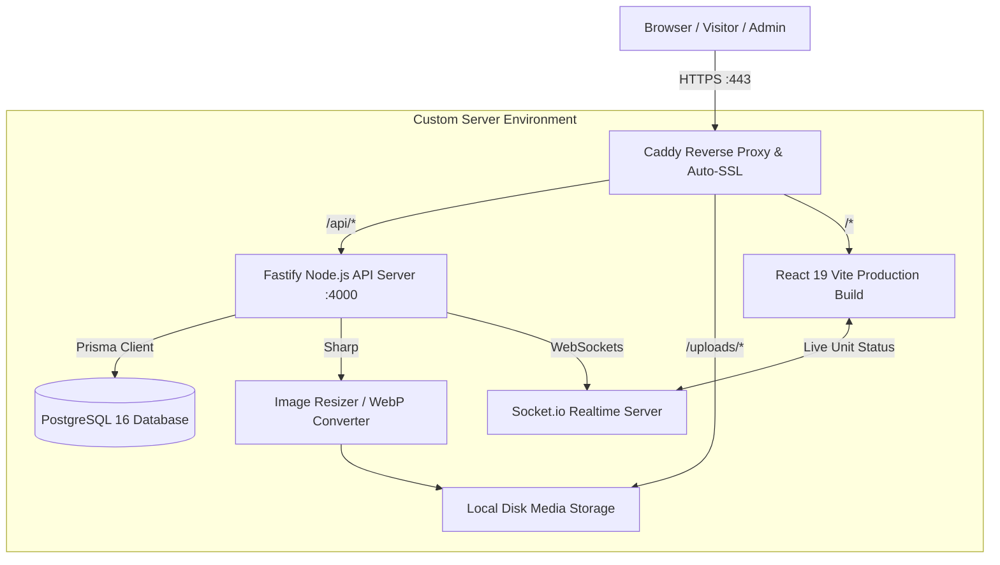

# 🏗️ Ajda Real Estate Platform — Architecture & Refactor Plan

> **Goal**: Convert the static frontend application (currently relying on `src/data/properties.ts` and `localStorage`) into a full-stack, production-grade Real Estate Management System running on a custom server.

---

## 📋 Table of Contents
1. [System Architecture Overview](#1-system-architecture-overview)
2. [Technology Stack](#2-technology-stack)
3. [Target Directory Structure](#3-target-directory-structure)
4. [Step-by-Step Implementation Roadmap](#4-step-by-step-roadmap)
   - [Phase 1: Local Backend & Database Setup](#phase-1-local-backend--database-setup)
   - [Phase 2: Database Modeling & Data Seeding](#phase-2-database-modeling--data-seeding)
   - [Phase 3: API & Services Development](#phase-3-api--services-development)
   - [Phase 4: Frontend Service Integration](#phase-4-frontend-service-integration)
   - [Phase 5: Local Testing & Validation](#phase-5-local-testing--validation)
   - [Phase 6: Production Dockerization & Deployment](#phase-6-production-dockerization--deployment)
5. [Master TODO Checklist](#5-master-todo-checklist)

---

## 1. System Architecture Overview



---

## 2. Technology Stack

### 🖥️ Frontend (Existing & Enhanced)
- **Framework**: React 19 + TypeScript + Vite
- **Styling**: Tailwind CSS v4
- **State/Data Fetching**: Custom API client service with reactive updates
- **Realtime**: `socket.io-client` for instant unit reservation & inquiry alerts
- **Map & 3D**: Leaflet (interactive pins) + Three.js

### ⚙️ Backend (New - Custom Server)
- **Runtime**: Node.js (v20+) with TypeScript
- **Web Framework**: **Fastify** (Ultra-high performance, native JSON Schema validation, lightweight)
- **Database**: **PostgreSQL 16** (Relational integrity for Projects ➔ Floors ➔ Units ➔ Inquiries)
- **ORM**: **Prisma ORM** (Type-safe schema, automated migrations, includes visual **Prisma Studio**)
- **File & Media Storage**: Local filesystem disk storage + **`sharp`** (Auto-compresses 4K photos to WebP; directly serves PDFs like `ajdaa_prime.pdf`)
- **Authentication**: JWT (JSON Web Tokens) with `bcrypt` password hashing & Role-Based Access Control (RBAC)
- **Realtime Sync**: **Socket.io** (Bidirectional live events for unit status changes)

### 🚀 Production & Deployment
- **Containerization**: Docker & Docker Compose
- **Web Server / Reverse Proxy**: **Caddy 2** (Automatic Let's Encrypt SSL, zero-maintenance HTTPS, static file streaming)
- **Process & Health Monitoring**: Docker restart policies + Healthcheck endpoints

---

## 3. Target Directory Structure

```
ajda/
├── server/                          # [NEW] Backend Node.js Fastify Application
│   ├── prisma/
│   │   ├── schema.prisma            # Prisma schema (Models, relations, enums)
│   │   ├── migrations/              # Auto-generated SQL migrations
│   │   └── seed.ts                  # Seeding script importing initial properties
│   ├── src/
│   │   ├── config/                  # Environment variables & constants
│   │   ├── middleware/              # Auth & RBAC guard middleware
│   │   ├── routes/                  # API endpoints
│   │   │   ├── auth.routes.ts       # Login, refresh token, current user
│   │   │   ├── projects.routes.ts   # Projects CRUD + floor plans
│   │   │   ├── units.routes.ts      # Unit status updates & floor queries
│   │   │   ├── inquiries.routes.ts  # Customer inquiry creation & CRM management
│   │   │   ├── users.routes.ts      # Admin user management
│   │   │   └── media.routes.ts      # Multi-part image/PDF file uploads
│   │   ├── services/                # Business logic, image compression (sharp)
│   │   ├── sockets/                 # Socket.io realtime server handlers
│   │   ├── types/                   # Backend type definitions
│   │   └── server.ts                # Fastify server entry point
│   ├── uploads/                     # Local disk media storage (images, PDFs)
│   ├── package.json
│   ├── tsconfig.json
│   └── Dockerfile
│
├── src/                             # [EXISTING] Frontend Vite Application
│   ├── services/
│   │   ├── api.ts                   # [NEW] Centralized Fetch/Axios API client
│   │   ├── projectService.ts        # [NEW] Live API calls for projects & units
│   │   ├── inquiryService.ts        # [NEW] Live inquiry submissions & CRM queries
│   │   ├── authService.ts           # [NEW] Live JWT authentication & session management
│   │   └── adminStorage.ts          # [REFACTORED] Adapts legacy calls to new live services
│   ├── hooks/
│   │   └── useRealtimeUnits.ts      # [NEW] Live socket listener for unit statuses
│   └── ...
│
├── docker-compose.yml               # [NEW] Multi-container orchestration (Postgres, API, Caddy)
├── docker-compose.dev.yml           # [NEW] Local development DB container
├── Caddyfile                        # [NEW] Production web server & reverse proxy
└── refactor.md                      # [THIS FILE] Architecture & Execution Plan
```

---

## 4. Step-by-Step Roadmap

### Phase 1: Local Backend & Database Setup
1. **Initialize Backend Workspace**:
   - Create `server/` directory.
   - Configure `package.json` with Fastify, `@fastify/cors`, `@fastify/multipart`, `@fastify/jwt`, `socket.io`, `sharp`, `bcrypt`, `dotenv`, and TypeScript.
2. **Setup Database Connection**:
   - Create `server/prisma/schema.prisma`.
   - Setup local PostgreSQL connection (or container via `docker-compose.dev.yml`).
   - Run initial migration: `npx prisma migrate dev --name init`.

### Phase 2: Database Modeling & Data Seeding
1. **Define Schema Entities**:
   - `AdminUser` (with roles: `super_admin`, `project_manager`, `sales_agent`, `viewer`).
   - `Project` (with multi-lingual fields, coordinates, pricing, badges).
   - `PropertyFloor` (floors linked to projects).
   - `PropertyUnit` (units with status: `available`, `reserved`, `rented`, `sold`).
   - `CustomerInquiry` (leads CRM pipeline: `new`, `contacted`, `closed`).
   - `CategoryItem` (commercial, logistics, office, residential).
2. **Write Data Migration/Seed Script**:
   - Parse existing [`src/data/properties.ts`](file:///d:/projects/html/ajda/src/data/properties.ts).
   - Insert all current projects, floors, and units into the database automatically.
   - Seed default admin user (`admin@ajdaa.sa`).

### Phase 3: API & Services Development
1. **Authentication & RBAC**:
   - `POST /api/auth/login` (generates JWT token).
   - `GET /api/auth/me` (verifies session).
   - Role-based route guards for Admin routes.
2. **Project & Unit Management APIs**:
   - `GET /api/projects` (with filters: city, type, priceType).
   - `GET /api/projects/:id` (returns full project with floors and units).
   - `POST /api/projects` & `PUT /api/projects/:id` (admin CRUD).
   - `PATCH /api/units/:id/status` (updates status and emits Socket.io event).
3. **Inquiries CRM APIs**:
   - `POST /api/inquiries` (public lead submission).
   - `GET /api/inquiries` (admin lead list with filters).
   - `PATCH /api/inquiries/:id` (update lead status & notes).
4. **Media & File Storage Service**:
   - `POST /api/media/upload` (accepts images & PDFs).
   - Image pipeline: Auto-compress to WebP using `sharp`.
   - Document pipeline: Store PDF brochures securely and return public `/uploads/...` URL.
5. **Real-time Engine**:
   - Setup Socket.io on Fastify server.
   - Broadcast `unit_status_updated` and `new_inquiry_received` events.

### Phase 4: Frontend Service Integration
1. **API Client Layer**:
   - Create `src/services/api.ts` with base URL, error handling, and JWT token injection.
2. **Refactor Data Access**:
   - Update [`src/services/adminStorage.ts`](file:///d:/projects/html/ajda/src/services/adminStorage.ts) to interface with the backend API instead of `localStorage`.
   - Provide backward-compatible async methods so existing components don't break.
3. **Admin Dashboard Upgrade**:
   - Update [`AdminDashboardPage.tsx`](file:///d:/projects/html/ajda/src/pages/admin/AdminDashboardPage.tsx):
     - Replace static image URL inputs with a real Drag-and-Drop file uploader.
     - Hook live project creation, unit editing, and user management to the API.
     - Connect inquiry CRM to live database.
4. **Real-time Unit Status Hook**:
   - Integrate `useRealtimeUnits` in [`ProjectDetailPage.tsx`](file:///d:/projects/html/ajda/src/pages/ProjectDetailPage.tsx) and unit modal so status updates reflect immediately across all open tabs.

### Phase 5: Local Testing & Validation
1. Start backend server (`npm run dev` in `server`).
2. Start frontend dev server (`npm run dev` in root).
3. Verify full workflow:
   - Browse projects and floor plans on client site.
   - Submit a "Register Interest" inquiry.
   - Log into Admin Dashboard with live JWT auth.
   - View newly submitted inquiry in real-time.
   - Change a unit's status from `available` to `reserved` and observe instant UI update.
   - Upload a new project image and verify compression and display.

### Phase 6: Production Dockerization & Deployment
1. **Docker Setup**:
   - Write `server/Dockerfile` (multi-stage optimized Node.js image).
   - Write root `docker-compose.yml` (PostgreSQL + Fastify API + Caddy Reverse Proxy).
   - Configure `Caddyfile` for auto-SSL on `ajdaa.sa`.
2. **Server Deployment Guide**:
   - Ubuntu server provisioning script.
   - Automated nightly database backup script (`pg_dump` with 14-day rotation).
   - Health monitoring and firewall rules (`ufw`).

---

## 5. Master TODO Checklist

### Phase 1: Local Backend Setup
- [ ] Initialize `server/` directory and configure `package.json`
- [ ] Setup TypeScript configuration (`tsconfig.json`)
- [ ] Install Fastify, Prisma, Socket.io, Sharp, Bcrypt, and Fastify JWT
- [ ] Create `schema.prisma` with all relational models
- [ ] Configure PostgreSQL database connection

### Phase 2: Database Migration & Seeding
- [ ] Generate initial Prisma migration
- [ ] Build automated seed script importing data from `src/data/properties.ts`
- [ ] Execute seed script and verify database population
- [ ] Test with Prisma Studio GUI (`npx prisma studio`)

### Phase 3: Fastify API Endpoints
- [ ] Implement JWT Authentication & Auth Routes (`/api/auth`)
- [ ] Implement Projects & Floors Routes (`/api/projects`)
- [ ] Implement Units Routes & Status Updates (`/api/units`)
- [ ] Implement Inquiries / CRM Routes (`/api/inquiries`)
- [ ] Implement Media Upload Service with Sharp WebP compression (`/api/media`)
- [ ] Implement Socket.io Realtime event broadcasting

### Phase 4: Frontend Refactoring
- [ ] Create `src/services/api.ts` HTTP client
- [ ] Create `src/services/propertyService.ts` for live project fetching
- [ ] Create `src/services/inquiryService.ts` for inquiry submission
- [ ] Refactor `src/services/adminStorage.ts` to bridge with live API
- [ ] Update `AdminLoginPage.tsx` with live JWT login
- [ ] Update `AdminDashboardPage.tsx` with real media upload & live CRM data
- [ ] Add `useRealtimeUnits` hook to sync floor plan changes live

### Phase 5: Local Verification
- [ ] Test public project browsing and filtering
- [ ] Test inquiry submission flow
- [ ] Test admin authentication & permissions
- [ ] Test unit status live synchronization between two browser windows
- [ ] Test media upload (images & PDF brochures)

### Phase 6: Production & Deployment
- [ ] Create `server/Dockerfile`
- [ ] Create production `docker-compose.yml`
- [ ] Configure `Caddyfile` with automated HTTPS & reverse proxy
- [ ] Create automated database backup script (`backup_db.sh`)
- [ ] Document complete deployment walkthrough for Ubuntu server
